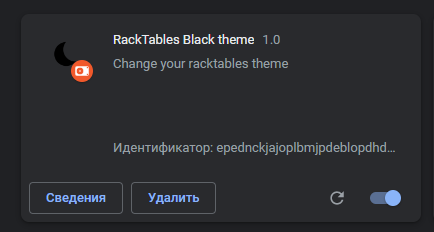
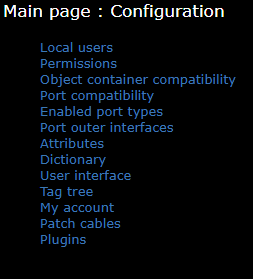
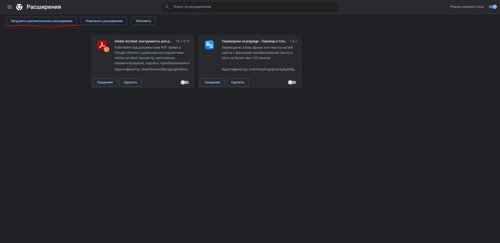

# RackTables-DarkTheme

# RackTables dark theme chrome extension

## racktables preview

## Instalation

Download the archive with the extension , then extract the files to a separate folder

Press this button

Select folder with unpacked extension

Change the extension setting, activation of the extension on click

## Usage

Click on the extension icon and activate the theme
